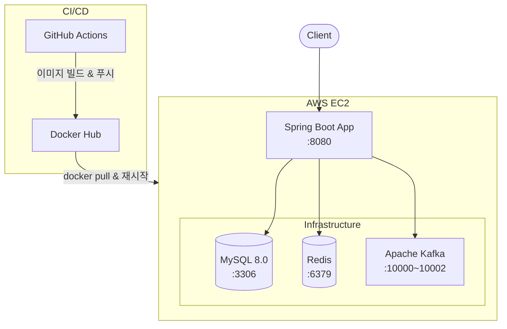
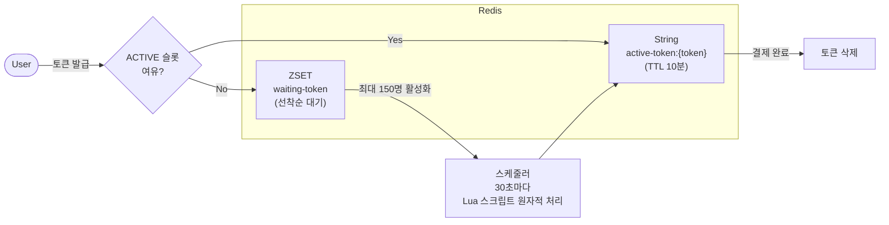
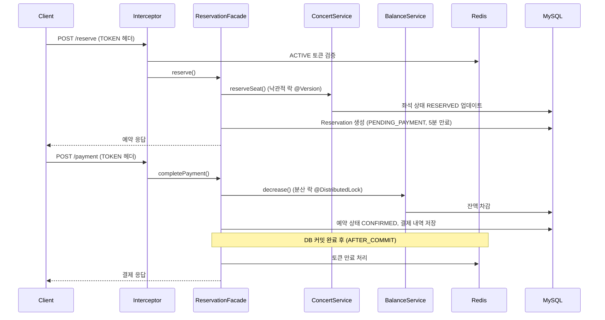

# 콘서트 예약 서비스

대기열 기반 콘서트 티켓 예약 시스템. 대규모 트래픽 상황에서 공정한 예약 처리를 위한 대기열 토큰 관리, 분산 락, 이벤트 드리븐 아키텍처를 적용했습니다.

---

## 기술 스택

| 분류 | 기술 |
|---|---|
| **Language** | Java 17 |
| **Framework** | Spring Boot 3.4.1 |
| **Database** | MySQL 8.0 |
| **Cache / Queue** | Redis (Bitnami) |
| **Messaging** | Apache Kafka |
| **Monitoring** | InfluxDB + Grafana |
| **Infra** | AWS EC2, Docker, Docker Hub |
| **CI/CD** | GitHub Actions |

---

## 핵심 기능

- **대기열 토큰 관리** — Redis ZSET(대기)과 String(활성) 구조로 대기열 구현. Lua 스크립트로 원자적 활성화 처리
- **콘서트 예약** — 좌석 선점 → 결제 → 확정 흐름. JPA Optimistic Lock으로 동시성 제어
- **분산 락** — Redisson 기반 `@DistributedLock` AOP로 잔액 충전/사용 동시성 제어
- **이벤트 드리븐 처리** — Kafka 토픽으로 결제/롤백 이벤트 비동기 처리 (Saga 패턴)

---

## 아키텍처

### 시스템 구성



### 대기열 토큰 흐름



### 예약 및 결제 흐름



### 도메인 모듈 구조

도메인 단위의 모듈형 레이어드 아키텍처를 따릅니다.

```
src/main/java/kr/hhplus/be/server/
├── balance/         # 잔액 충전/사용, Kafka 컨슈머로 차감/롤백
├── concert/         # 콘서트, 스케줄, 좌석 관리
├── payment/         # Kafka 기반 비동기 결제 처리
├── queueToken/      # Redis 대기열 토큰 관리
├── reservation/     # 예약 오케스트레이션 (Facade 패턴)
├── user/            # 사용자 엔티티
└── common/          # 분산 락 AOP, 인터셉터, 전역 예외 처리
```

각 도메인은 아래 레이어로 구성됩니다.
```
presentation/    # Controller, DTO, Scheduler
application/     # Facade, Event Producer/Consumer
domain/          # Model, Service, Repository Interface, Exception
infrastructure/  # JPA/Redis Repository 구현체
```

---

## 로컬 실행

**사전 요구사항:** Docker, Java 17

```bash
# 1. 인프라 실행 (MySQL, Redis, Kafka, Grafana)
docker-compose up -d

# 2. 애플리케이션 실행
./gradlew bootRun

# 3. 빌드 (테스트 제외)
./gradlew build -x test

# 4. 테스트 실행
./gradlew test
```

접속: `http://localhost:8080`

---

## CI/CD 파이프라인

`main` 브랜치에 머지되면 자동으로 빌드 & 배포됩니다.

```
git push → GitHub Actions
               ├── [Job 1] Docker 이미지 빌드 → Docker Hub 푸시
               └── [Job 2] EC2 SSH 접속 → 최신 이미지 Pull → 컨테이너 재시작
```

자세한 내용: [docs/cicd/github-actions-ec2-deploy.md](docs/cicd/github-actions-ec2-deploy.md)

---

## 문서

- [마일스톤](https://github.com/users/Kimseonbeen/projects/2/views/3)
- [시퀀스 다이어그램](https://github.com/Kimseonbeen/hhplus-concert/wiki/%EC%8B%9C%ED%80%80%EC%8A%A4-%EB%8B%A4%EC%9D%B4%EC%96%B4%EA%B7%B8%EB%9E%A8)
- [플로우 차트](https://github.com/Kimseonbeen/hhplus-concert/wiki/%ED%94%8C%EB%A1%9C%EC%9A%B0-%EC%B0%A8%ED%8A%B8)
- [ERD](https://github.com/Kimseonbeen/hhplus-concert/wiki/ERD)
- [CI/CD 구성 및 트러블슈팅](docs/cicd/github-actions-ec2-deploy.md)
- [버그픽스: 토큰 만료 타이밍](docs/bugfix/token-expiry-after-commit.md)
